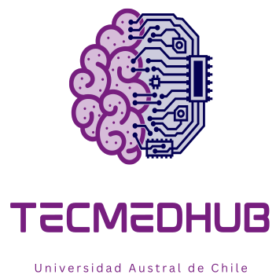

## Sobre nosotros

TecMedHub es un laboratorio tipo FabLab de la Universidad Austral de Chile, sede Puerto Montt, enfocado en la investigación y desarrollo de tecnologías médicas para la evaluación, diagnóstico y rehabilitación. Además, nos especializamos en la fabricación de equipos y software educativo en el área de simulación clínica.

### Ubicación

Nos encontramos en el edificio 500 de Ciencias de la Salud, tercer piso, de la sede Puerto Montt de la Universidad Austral de Chile.

### Trayectoria

- Establecidos hace dos años
- Primer año con nombre e identidad propia como TecMedHub

## Nuestro trabajo

### Áreas de enfoque

1. Tecnologías médicas para evaluación y diagnóstico
2. Tecnologías médicas para rehabilitación
3. Equipos y software educativo para simulación clínica

### Proyectos actuales

- 6 tesis de pregrado en curso
- 2 tesis finalizadas
- 1 tesis doctoral en desarrollo

## Equipo

Nuestro laboratorio cuenta con un equipo diverso y altamente capacitado:

- 11 tesistas
- 4 docentes, incluyendo:
  - Ms. Nicolás Quezada
  - Dra. Fernanda López
  - Ms. Cristina Vargas
  - Mg. Haydeé Barrientos
  - Mg. Marco Barra
- Vanessa Uribe, tesista fija trabajando en el proyecto FissioAccess

## Equipamiento

En TecMedHub contamos con una amplia gama de equipos de última generación que nos permiten llevar a cabo nuestros proyectos de investigación y desarrollo. Nuestro equipamiento incluye:

- 2 impresoras SLA
- 8 impresoras FFF
- Plotter de corte
- Estación de soldado SMD
- Cortadora/grabadora láser por diodo
- CNC router
- Scanner 3D
- Entre otras tecnologías

Para obtener información más detallada sobre nuestro equipamiento y sus capacidades, consulta nuestro [listado completo de equipos](equipment.md).

## Contacto

Para más información, puedes contactarnos en:

Email: david.avil@auach.cl

## Proyectos destacados

1. **SimPEATC (SimABR)**: SimPEATC es un Simulador de Potenciales Evocados de Tronco Cerebral. Este proyecto está diseñado para estudiantes de electrofisiología auditiva, con el objetivo de recrear el procedimiento completo de PEATC (Potenciales Evocados Auditivos de Tronco Cerebral). Proporciona una herramienta educativa valiosa para la práctica y comprensión de esta importante técnica diagnóstica.
   [GitHub](https://github.com/TecMedHub/SimPEATC)

2. **AutoStrabus**: AutoStrabus es un sistema innovador diseñado para la evaluación automática del estrabismo y los movimientos oculares. Utiliza tecnología de visión por computadora junto con gafas de video oculografía para detectar desviaciones oculares de forma precisa y eficiente.
   [GitHub](https://github.com/TecMedHub/AutoStrabus)

3. **SimHit**: SimHit es un proyecto de simulador open source destinado a revolucionar la educación en otorrinolaringología, proporcionando una herramienta eficaz para el entrenamiento en la realización del impulso cefálico. Este simulador busca mejorar la precisión y eficacia en la enseñanza y práctica de esta técnica crucial para el diagnóstico y tratamiento de trastornos del equilibrio.
   [GitHub](https://github.com/TecMedHub/SimHit)

4. **LabSim**: LabSim es un Simulador Virtual de exámenes auditivos y oculares. Este proyecto proporciona una plataforma interactiva para que los estudiantes y profesionales de la salud practiquen y perfeccionen sus habilidades en la realización de exámenes auditivos y oculares en un entorno virtual seguro y controlado.
   [GitHub](https://github.com/TecMedHub/LabSim)

5. **SimVor**: SimVor es una simulación interactiva desarrollada en JavaScript que demuestra el funcionamiento del reflejo vestíbulo-ocular. Esta aplicación web utiliza los sensores de movimiento de los dispositivos móviles para simular cómo los ojos se mueven en respuesta a los movimientos de la cabeza, proporcionando una herramienta educativa visual y práctica para entender este importante reflejo fisiológico.
   [GitHub](https://github.com/TecMedHub/SimVor)

6. **FullAxis**: FullAxis es un sistema integral de evaluación neurootológica que combina tres componentes clave:
   - Un sistema de evaluación postural mediante IMU (Unidad de Medición Inercial)
   - VNG (Videonistagmografía)
   - vHIT (Video Head Impulse Test)
   Este sistema completo permite una evaluación exhaustiva del sistema vestibular y del equilibrio, proporcionando a los profesionales médicos herramientas avanzadas para el diagnóstico y seguimiento de trastornos neurootológicos.
   [GitHub](https://github.com/TecMedHub/FullAxis)

7. **SimAudio**: SimAudio es un audiómetro de simulación avanzado que permite a los usuarios configurarlo para generar respuestas patológicas. Esta herramienta es invaluable para la formación de audiólogos y otros profesionales de la salud auditiva, ya que les permite practicar la interpretación de resultados audiométricos en una variedad de condiciones patológicas simuladas. SimAudio mejora la capacidad de los estudiantes y profesionales para diagnosticar y comprender diferentes trastornos auditivos en un entorno controlado y educativo.
   [GitHub](https://github.com/TecMedHub/SimAudio)

8. **FissioAccess**: FissioAccess es un sistema económico y de código abierto diseñado para la adquisición de diversos parámetros fisiológicos, incluyendo electrocardiograma, electromiografía, presión arterial y electroencefalograma. El objetivo principal es proporcionar una alternativa accesible y flexible a equipos comerciales costosos como PowerLab, para su uso en prácticas de laboratorio en fisiología. Este proyecto busca ofrecer a las instituciones educativas herramientas económicas y adaptables para la enseñanza práctica, especialmente en situaciones con recursos limitados. La elección de plataformas de código abierto permite una mayor personalización y flexibilidad, facilitando la adaptación del sistema a una variedad de necesidades educativas y técnicas.
   [GitHub](https://github.com/TecMedHub/FissioAccess)

9. **Sirrov**: Sirrov es un simulador interactivo robotizado del reflejo óculo-vestibular. Consiste en una cabeza animatrónica que mueve los ojos en respuesta al movimiento de la cabeza, simulando el reflejo vestíbulo-ocular. Además de reproducir el comportamiento normal, Sirrov puede ser configurado para simular diferentes patologías y ejecutar movimientos oculares automatizados. Esta herramienta proporciona una experiencia de aprendizaje única y práctica para estudiantes y profesionales en el campo de la neurología y otorrinolaringología, permitiéndoles observar y comprender de manera tangible los complejos mecanismos del sistema vestibular y ocular.
   [GitHub](https://github.com/TecMedHub/Sirrov)

10. **AirFlow**: AirFlow es un equipo avanzado de evaluación respiratoria que integra en un solo dispositivo embebido un espirómetro y un rinomanómetro. Este sistema combinado permite una evaluación completa de la función respiratoria, midiendo tanto el flujo y volumen de aire en los pulmones (espirometría) como el flujo de aire y la resistencia en las vías nasales (rinomanometría). La integración de estas dos funcionalidades en un único dispositivo compacto facilita una evaluación más eficiente y exhaustiva de la salud respiratoria, siendo una herramienta valiosa tanto para el diagnóstico clínico como para la investigación en el campo de la neumología y otorrinolaringología.
    [GitHub](https://github.com/TecMedHub/AirFlow)

## Cómo contribuir

En TecMedHub, valoramos la colaboración y ofrecemos varias formas de contribuir:

1. **Pasantías**: Ofrecemos oportunidades de pasantías en el laboratorio. Los pasantes pueden integrarse a proyectos en curso y obtener experiencia práctica en tecnologías médicas y simulación clínica.

2. **Donaciones**: Aceptamos donaciones, principalmente destinadas a la compra de consumibles para nuestros proyectos. Estas contribuciones son fundamentales para mantener y expandir nuestras capacidades de investigación y desarrollo.

Si estás interesado en colaborar con nosotros, ya sea a través de una pasantía o una donación, por favor contáctanos utilizando la información proporcionada en la sección de contacto.

## Licencia

La mayoría de nuestros proyectos se comparten bajo la licencia MIT. Esta licencia permite el uso, copia, modificación, fusión, publicación, distribución, sublicencia y/o venta de copias del software, siempre y cuando se incluya el aviso de copyright y permiso en todas las copias o partes sustanciales del software.

Para más detalles sobre la licencia específica de cada proyecto, por favor revisa el archivo LICENSE en el repositorio correspondiente.
